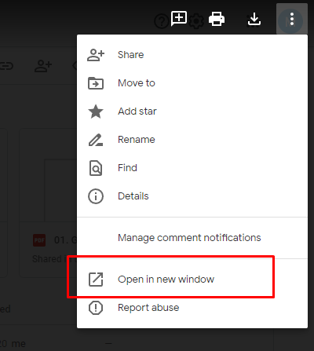

# Email Templates

This repository includes the basics of coding responsive emails. It will show you how to make an email that is always responsive. Even in a worst-case scenario eg. where CSS support is not available.

**Table of contents**

- Preamble
  - Resources
  - Testing Guide
  - Image hosting
- Getting Started Guide
  - Intro
  - Basics
  - outer-container/Ghost tables
  - Banner/Single Column
  -

## Preamble

#### 1. Resources

- [Getting Started Guide | `Oct 21, 2021`](https://webdesign.tutsplus.com/tutorials/creating-a-future-proof-responsive-email-without-media-queries--cms-23919)

- [Good guide2](https://www.goodemailcode.com/email-code/template.html)

- [Checking suppot](https://www.caniemail.com/features/)

- [Email container](https://www.emailonacid.com/blog/article/email-development/which-code-should-i-include-in-every-email/)

- [good read](https://www.emailonacid.com/blog/article/email-development/email-development-best-practices-2/)

#### 2. Testing site

[Testing](https://www.putsmail.com/tests/new)
Send HTML Emails using this: https://www.thunderbird.net/en-US/

#### 3. Image hosting



[Image hosting](Google drive)
[lightshot create QR code](https://www.lightshot.org/en/create-qr-code)

https://drive.google.com/u/0/uc?id=`[insert id]`&export=view
id can be found in the url here

## Getting started Guide

**Some rules**

1. Emails have a width of 660px
2. Outlook dose not support max width, margin, display inline block
3. Since outlook is unpredictable with margins we use a spacer element
4. Since outlook is unpredictable with margins we use h1 and p tags since margin is supported for these tags, we also want to specify a font-family since email clients will override if we don't have on on the element level  
5. We favor divs over tables 
6. Remember padding on the left and right should be the same since when things stack on mobile they look the same on both sides 
 

#### 1. Intro

**Problem**
Email clients will sometimes strip the key portions from the `<head>` which often contains CSS and media queries. Some email clients will send only the `<body>` tag. This tutorial will help you to create a responsive emails keeping these situations in mind.
`For example: Gmail app on your phone allows non gmail accounts but strips the <style> tags`

**Solution**
Method: `Fluid hybrid` approach
Definition: `fluid` refers to using `%` and elements that expand to fill there space. `hybrid` is because we use max-width to constrain the free flowing elements.

1.  ..That it; comes in at a tidy 17kb file size!
2.  This approach ensures that your columns all aligned in the center on mobile even without media queries
3.  This approach ensures that your columns have the ability to vertically align themselves on mobile even without media queries
4.  This approach gives you total control over content blocks that stack and flow

#### 2. Basics

1. We already know what these are: `<!DOCTYPE html>`,`<html..`, `<meta charset=...`, `<meta name="viewport"...`

2. `<meta http-equiv="X-UA-Compatible" content="IE=edge" />` display content in the highest IE mode available. Only useful if the user is using IE8, 9 and 10. It is disabled in IE11 which is the current stable version of IE. So this is up to you to decide if you want to use it or not.But if you do use it you need to add `<!--[if !mso]><!-->` before and `<!--<![endif]-->` after so images in mo are not messed up

3. `<title></title>` it is best to leave the title tag empty since some clients display the title right after the subject line

4. `<!--[if mso]>` and `<![endif]-->` are styles applied only to Microsoft Outlook

5. `border-spacing:0` is used to remove the space between the cells in the table. And `margin:0 !important` for `<div>` tags, otherwise Outlooks add extra space

6. `<o:OfficeDocumentSettings>` tells MO to use base resolution of 96dpi

7. The `<body>` tag has basic styles: margin padding word-space and background.

8. The wrapper `<div>` contains the main content and sets some CSS for text sizing and language. `aria-roledescription="email"` for screen readers to announce the email. And `role="article"` tells screens readers how to interpret.

9. Lastly we include a big wrapper table to help center the main content. We always set the role to presentation.

```html  
<!DOCTYPE html>
<html
  lang="en"
  xmlns="https://www.w3.org/1999/xhtml"
  xmlns:o="urn:schemas-microsoft-com:office:office"
>
  <head>
    <meta charset="utf-8" />
    <meta name="viewport" content="width=device-width,initial-scale=1" />
    <meta name="x-apple-disable-message-reformatting" />
    <!--[if !mso]><!-->
    <meta http-equiv="X-UA-Compatible" content="IE=edge" />
    <!--<![endif]-->
    <title></title>
    <!--[if mso]>
      <style type="text/css">
        table {
          border-collapse: collapse;
          border: 0;
          border-spacing: 0;
          margin: 0;
        }
        div, td {padding: 0;} div {margin: 0 !important;}
      </style>
      <noscript>
        <xml>
          <o:OfficeDocumentSettings>
            <o:PixelsPerInch>96</o:PixelsPerInch>
          </o:OfficeDocumentSettings>
        </xml>
      </noscript>
    <![endif]-->
  </head>
  <body
    style="margin:0;padding:0;word-spacing:normal;background-color:#ffffff;"
  >
    <div
      role="article"
      aria-roledescription="email"
      lang="en"
      style="-webkit-text-size-adjust:100%;-ms-text-size-adjust:100%;background-color:#ffffff;"
    >
      <table role="presentation" style="width:100%;border:0;border-spacing:0;">
        <tr>
          <td align="center">[content goes here]</td>
        </tr>
      </table>
    </div>
  </body>
</html>
```

#### 2. Outer Container / Ghost tables

**Problem**
We need to cater separately for Outlook on windows
since will be using `<divs>` that use max-width and display inline block and outlook dose not support these. So we will nest out code inside `[if mos]`

**Solution**
out ghost table will have `width = 660px` and other clients will have a div with`width:96% max-width:660px` meaning we have 2% padding on smaller screens

Note: margin

```html
<!--[if mso]>
<table role="presentation" align="center" style="width:660px;">
<tr>
<td style="padding:20px 0;">
<![endif]-->
<div class="outer" style="width:96%;max-width:660px;margin:20px auto;">
  [content goes here]
</div>
<!--[if mso]>
</td>
</tr>
</table>
<![endif]-->
```

#### 3. Banner / Single Column
At this point we have setup our outer structure. Now it is time to add some content!!!
**We usually favor `<div>` tags over `<table>` tags but for this single column we will use `<table>` instead of a `<div>` tag with a ghost table.** since it saves code.
1. Recall we have `role="presentation"` for all tables 
2. In `<td>` We have padding of 10px on all sides with extra at the bottom. If it contains test use `text-align:left;` so some clients would inherit from the wrapper `<td>` align center  
3. `` tag `width:100%;height:auto;` so the image is 100% wide and always preserves its aspect ratio


```html
<table role="presentation" style="width:100%;border:0;border-spacing:0;">
    <tr>
        <td style="padding:10px 10px 20px 10px;font-family:Arial,sans-serif;font-size:24px;line-height:28px;font-weight:bold;">
            
        </td>
    </tr>
    <tr>
        <td style="padding:10px;text-align:left;">
            <h1 style="margin-top:0;margin-bottom:16px;font-family:Arial,sans-serif;font-size:26px;line-height:32px;font-weight:bold;">Email Title</h1>
            <p style="margin:0;font-family:Arial,sans-serif;font-size:18px;line-height:24px;">This is email is is created using a Fluid Hybrid approach </p>
        </td>
    </tr>
</table>
```

#### 4.The spacer 


The spacer element since outlook margins can be unpredictable 
```html
<div class="spacer" style="line-height:26px;height:26px;mso-line-height-rule:exactly;">&nbsp;</div>
```

#### 5. Two-Column Layout that will be centered on mobile 
The container 
1. The `font-size` on the container is set to 0 to make sure no extra spaces make our containers stack
2. The test-align is set to center so the containers are stacked and centered on mobile but in-order to make then stack we need display-inline-block ono the cells 

The 2 cells:
1. `display-inline-block` so they stack on mobile and follow the containers text align property  
2. To make the cells have 100% width on on mobile and a max of 330px (aka 660/2): `width:100%;max-width:330px`
3. We can also vertically align the cells by setting `vertical-align:top`

The 2 ghost cells
1. We have 2 cells that are `width:50%` and `width:50%` in outlook
2. `valign="middle"` to match the `vertical align: top`
3. Lastly some padding for outlook `padding:10px`


Last note: box-sizing: border-box; is not supported (this allows padding on the inside of the container)
The way we solve this issue is by nesting an extra div inside with the padding so the cells now become 310px wide and centered on mobile.
 

```html
<div class="two-col" style="text-align:center;font-size:0">
    <!--[if mso]>
    <table role="presentation" width="100%">
    <tr>
      <td style="width:50%;padding:10px;" valign="middle">
    <![endif]-->
    <div class="column" style="width:100%;max-width:330px;display:inline-block;vertical-align:top">
        <div style="padding:10px;">
          [content goes here]
        </div>
    </div>
    <!--[if mso]>
    </td>
      <td style="width:50%;padding:10px;" valign="middle">
    <![endif]-->
    <div class="column" style="width:100%;max-width:330px;display:inline-block;vertical-align:top">
        <div style="padding:10px;">
          [content goes here]
        </div>
    </div>
    <!--[if mso]>
    </td>
    </tr>
    </table>
    <![endif]-->
</div>
```


#### 6. Two-Column Layout with Fluid Hybrid Image and text 
**image**
1. Wrap images in `<p>` tags so we can add margins 
2. The images have a width of 310px since thats all the space available in the col 
  - width="310" for outlook
  -  style="width:310px" for other clients
3. display:block; to prevent gaps under images
4. `max-width:100%;` always 100% of the column width
5. `height:auto;` to prevent stretching the image
6. Note: if your image is smaller than 310px use that width instead; or your image will be stretched.
    - keep gaps under image:  using `text-align` on the p tag and remove the `display block` on the image
    - get rid of gaps on the image: Keep the `display block` and add `margin auto` to the image and add `text align` to the parent | so the gaps at the bottom are gone but its still aligned horizontally 
   
Note: pixel max-widths on img tags are not supported by outlook so we will use `max-width:100%`

```html
<p style="margin:0;font-family:Arial,sans-serif;font-size:14px;line-height:18px;">
    
</p>

```
**text**
1.  outer div sets the text size
2.  

```html
<div style="padding:10px;font-size:14px;line-height:18px;text-align:left;">
    <p style="margin-top:0;margin-bottom:12px;font-family:Arial,sans-serif;font-weight:bold;">
     Some cool text
    </p>
    <p style="margin-top:0;margin-bottom:14px;font-family:Arial,sans-serif;">
      Some more awesome text!
    </p>
    <p style="margin:0;font-family:Arial,sans-serif;">
       <a href="https://example.com/" style="background: #ffffff; border: 2px solid #8dc1d6; text-decoration: none; padding: 10px 25px; color: #000000; border-radius: 4px; display:inline-block; mso-padding-alt:0;text-underline-color:#ffffff">
          <!--[if mso]>
          <i style="letter-spacing: 25px;mso-font-width:-100%;mso-text-raise:20pt">&nbsp;</i>
          <![endif]-->
          <span style="mso-text-raise:10pt;font-weight:bold;">
          Claim yours now
          </span>
          <!--[if mso]>
          <i style="letter-spacing: 25px;mso-font-width:-100%">&nbsp;</i>
          <![endif]-->
       </a>
    </p>
</div>

```

 